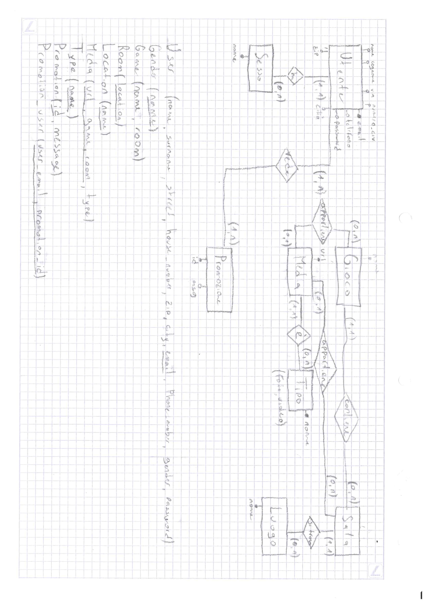

# GESTIONE CASINÒ | Diario di lavoro - 22.02.2019
##### Matan Davidi, Thor Düblin, Matteo Forni, Carlo Pezzotti, Mattia Toscanelli
### Trevano, 22 Febbraio 2019

## Lavori svolti
Durante la giornata di oggi Matan ha terminato lo schema logico usato per la progettazione del database, che trovate di seguito.

Durante la giornata di oggi Thor ha continuato l'installazione del WebDriver di Selenium, riuscendo a risolvere il problema legato al pom.xml dell'ultima lezione.
Mattia Toscanelli oggi ha continuato con l'adattamento del sito web al contesto. Più precisamente ha completato la pagina di registrazione inserendo tutti i vari input necessari ed in seguito ha completato la pagina di login inserendo un'immagine più inerente alla pagina e i inoltre l'opzione per recuperare la password in caso fosse stata dimenticata. Infine ha iniziato a creare la pagina di recupero della password e di conferma della email.

##  Problemi riscontrati e soluzioni adottate
Carlo ha sollevato il discorso dell'indice utilizzato per la tabella 'User' del database: secondo lui, infatti, sarebbe meglio aggiungere una colonna 'id' all'entity set perché questo renderebbe le operazioni in PHP più semplici e veloci, mentre Matan afferma che così facendo si aggiungerebbe una colonna inutile all'entità che appesantirebbe qualsiasi operazione su di essa.
Abbiamo intenzione di discuterne al prossimo stand-up.

Inoltre Matan ha avuto problemi a scannerizzare il foglio sul quale ha disegnato il diagramma E/R e lo schema logico sulla stampante di scuola. Alla fine ha dovuto salvare il risultato della scansione, sotto forma di file PDF, su una chiavetta USB, utilizzando il menù "Pannello USB".

Thor ha risolto il problema degli errori quando digitava "mvn clean install" nella cartella del progetto di Selenium. I problemi erano causati da un errata configurazione del file pom.xml, che non riconosceva delle versioni di Maven.
Il seguente codice è quello modificato, che permette il corretto funzionamento del "mvn clean install"

Mattia Toscanelli ha avuto difficoltà ad accedere al server ftp in quanto aveva dimenticato i dati d'accesso. Inoltre ha avuto problmei nel mettere responsive l'input select. Dopo qualche modifica in css è riuscito.
```xml
<?xml version="1.0" encoding="UTF-8"?>
<project xmlns="http://maven.apache.org/POM/4.0.0"
                 xmlns:xsi="http://www.w3.org/2001/XMLSchema-instance"
                 xsi:schemaLocation="http://maven.apache.org/POM/4.0.0 http://maven.apache.org/xsd/maven-4.0.0.xsd">
        <modelVersion>4.0.0</modelVersion>
        <groupId>MySel20Proj</groupId>
        <artifactId>MySel20Proj</artifactId>
```
Un altro problema riscontrato oggi è quello della configurazione proxy da parte di Maven, che non permetteva lo scaricamento da internet, per risolvere questo problema, è bastato andare nella cartella conf di Maven ed aggiungere il codice per la configurazione del Proxy.
```xml
<proxy>
      <id>cpt.local</id>
      <active>true</active>
      <protocol>http</protocol>
      <host>proxy.cpt.local</host>
      <port>8080</port>
      <username>proxyuser</username>
      <password>somepassword</password>
</proxy>
```
##  Punto della situazione rispetto alla pianificazione


## Programma di massima per la prossima giornata di lavoro
Matan deve preoccuparsi di mostrare lo schema logico al cliente in modo da poter correggere eventuali errori.

Mattia continuerà la pagina di password smarrita e la pagina di verifica della email.
