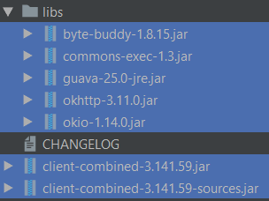

# GESTIONE CASINÒ | Diario di lavoro - 15.03.2019
##### Matan Davidi, Thor Düblin, Matteo Forni, Carlo Pezzotti, Mattia Toscanelli
### Trevano, 15 marzo 2019

## Lavori svolti
Data l'assenza di Thor, oggi Matan si è occupato di prendere in mano il suo lavoro e portarlo avanti. Come prima cosa, quindi, si è informato velocemente su come funzionasse Selenium, poi ha creato un'applicazione di test usando la libreria di Selenium WebDriver. L'applicazione che ha creato stampa su terminale il titolo della pagina del [sito del casinò](http://www.cashyland.tk) (http://www.cashyland.tk). Per farlo si è aiutato con questo [tutorial per creare i test](https://wiki.saucelabs.com/display/DOCS/Getting+Started+with+Selenium+for+Automated+Website+Testing#GettingStartedwithSeleniumforAutomatedWebsiteTesting-TheSevenBasicStepsofSeleniumTests) (https://wiki.saucelabs.com/) e con quest'altro [tutorial per avviare i test senza interfaccia grafica](https://www.built.io/blog/run-selenium-tests-in-headless-browser) (https://www.built.io/blog/run-selenium-tests-in-headless-browser).

Come prima cosa ha dovuto scaricare le librerie di Selenium WebDriver seguendo questo [link](https://www.seleniumhq.org/download/) (https://www.seleniumhq.org/download/), poi ha creato un progetto di prova per cominciare a fare qualche test con Selenium che ha chiamato *SeleniumTest*, all'interno del quale ha importato tutte le librerie scaricate:



In seguito ha scritto il seguente codice:
```java
//  System.setProperty("webdriver.chrome.driver", "ChromeDriverPath");
//  ChromeOptions options = new ChromeOptions();
//  options.addArguments("headless");
//  options.addArguments("window-size=1200x600");
    WebDriver driver = new ChromeDriver(/* options */);
    driver.get("http://www.cashyland.tk");

    WebElement title = driver.findElement(By.tagName("title"));
    String titleText = title.getText();
    System.out.println(titleText);

    GroovyTestCase.assertEquals(titleText, "Neuron HTML CSS Template");

    driver.quit();
```
Dove la parte commentata serve per eseguire il test senza interfaccia grafica. Questo snippet di codice apre la pagina della gestione del casinò, trova l'elemento "title", prende il testo e certifica che il testo è uguale a "Neuron HTML CSS Template".

Matteo ha risolto, probabilmente, il problema che non lo lasciava collegare Jenkins alla repo di produzione semplicemente salvando le credenziali nel sistema con il comando:
```
git config --global credential.helper store
```
e modificando lo script eliminando le parti inutili del comando push.


Il funzionamento dello script con Jenkins non è potuto però essere testato dato che esso non funziona come dovrebbe.

Mattia Toscanelli oggi ha lavorato ancora con la pagina di registrazione, in particolare con la verifica lato client dei dati. Questo è successo perchè dopo qualche test eseguito a mano si è scoperto che erano presenti degli errori. Uno degli errori riscontrati è il controllo delle due password, più precisamente la verifica che le due password siano uguali, di lunghezza minima 8, che abbia almeno un numero e infine che abbia almeno una maiuscola. Questo è stato risolto così:
```java
//Controllo se le password sono uguali
function checkPassword(pas1, pas2){
    return (pas1 == pas2) && pas2.toLowerCase() != pas1 && /\d/.test(pas1) && pas1.length > 7;
}
```

Quando è presente un errore nel valore inserito all'interno di un campo, quest'ultimo diventa rosso. Però, quando vi si inserisce nuovamente un valore valido, quest'ultimo deve ritornare al colore di partenza. Questo non accadeva ed è stato corretto impostando il colore di sfondo del campo a bianco con il seguente codice:
```java
//rimuove il colore rosso dagli input errati
function normal(input){
    input.style.backgroundColor = "white"; 
}
```

Infine ha corretto piccoli errori trascurabili e ha spostato la netifica di errore da in alto a destra ad in basso a sinistra con il seguente codice:
```java
inputs.style.backgroundColor = "white";
```

##  Problemi riscontrati e soluzioni adottate
Mattia ha speso molto del suo tempo a mettere a posto un errore causato da un collega, ma purtroppo non lo ha trovato dunque è tornato sulla versione vecchia ed ha aggiunto le

Matteo, prima di trovare la soluzione spiegata sopra, ha provato a far funzionare lo script che esegue i push utilizzando su Jenkins come "post build operations" un git publisher ma esso esegue solamente il push sulla stessa repo in cui ha eseguito i test.
Fatto ciò ha riscontrato problemi con Jenkins, esso non esegue più le compilazioni correttamente dato che non riesce ad eseguire il fetch sulla cartella di GitHub.

 Questo problema c'è da mercoledì 13 marzo ma non era stato notato. Non è stata ancora trovata una soluzione. È stato provato oggi a modificare inizialmente i permessi sul file git/config dato che uno dei messaggi di errore era dovuto ai privilegi sul file ma non è servito così come cambiare il proprietario del file. Cercando su internet un'altra possibile causa del problema poteva essere la mancanza di spazio nella cartella /var/lib/jenkins/workspace ma pur avendo eliminato tutti i files inutili da essa la situazione non cambia. L'ultimo tentativo fatto, anche esso trovato su internet, è stato quello di aggiungere un comportamento supplementare a Jenkins così che ad ogni compilazione eliminasse la repo prima di forzare il clone ma ciò porta solo ulteriori errori.
 

Matan ha avuto il problema dove non viene trovata la classe usata per fare gli *assert* all'interno della sua applicazione, ossia GroovyTestCase, anche se essa è stata importata. Infatti viene mostrato il seguente errore:

```
Error:(22, 23) java: cannot access junit.framework.TestCase
  class file for junit.framework.TestCase not found
```

##  Punto della situazione rispetto alla pianificazione
Rispetto alla pianificazione siamo in orario.

## Programma di massima per la prossima giornata di lavoro
Matteo ha intenzione di rimettere in funzione Jenkins e testare se lo script funziona con esso.

Mattia Toscanelli ha intenzione di creare la pagina di messaggio che è stata inviata una mail di recuppero password ed inoltre inizierà la pagina di benvenuto.

Matan deve riuscire a sistemare il problema che presenta la sua applicazione a causa dell'importazione delle librerie.
