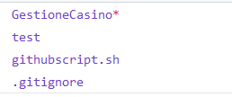
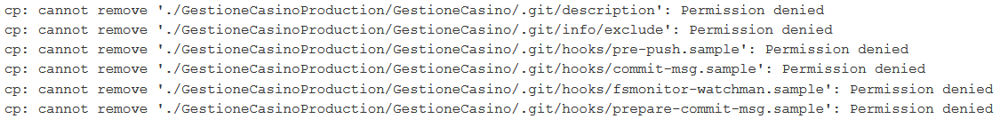

# GESTIONE CASINÒ | Diario di lavoro - 29.03.2019
##### Matan Davidi, Thor Düblin, Matteo Forni, Carlo Pezzotti, Mattia Toscanelli
### Trevano, 29 marzo 2019

## Lavori svolti
Matan ha proseguito con la documentazione del progetto, terminando il capitolo 1.6, Pianificazione.

Matteo e Carlo hanno continuato a lavorare su Jenkins risolvendo il problema delle cartelle non apribili che venivano create, per fare ciò le abbiamo semplicemente inserite nel file .gitignore creato appositamente.
s

Fatto ciò abbiamo scoperto che vi ra un ulteriore problema di permessi, Jenkins non poteva escludere le cartelle e i files che vi erano nel file gitignore.


Risolto questo problema sono stati eseguiti dei test di push ed abbiamo potuto affermare che Jenkins funziona correttamente: ad ogni push esegue i test e, se risultano corretti, copia tutto nel repo di produzione e lo pusha.

Fatto ciò abbiamo provato a modificare la cartella dove apache tiene i files cambiandola con
```
/var/lib/jenkins/workspace/GestioneCasinoProduction
```
ma abbiamo avuto, anche qui, dei problemi di permessi.

##  Problemi riscontrati e soluzioni adottate
Matan è riuscito a "risolvere" il problema del capitolo 1.4 della documentazione, Analisi del dominio, scrivendo che l'applicazione è partita da zero.

Il problema riscontrato da Matteo e Carlo era che Jenkins non aveva i permessi per escludere le cartelle inserite nel .gitignore. Abbiamo inizialmente provato, nello script, a fare si che Jenkins cambiasse l'utente utilizzato in quello di root e per farlo abbiamo utilizzato degli script trovati su internet ma nessuno era funzionante ed abbiamo quindi deciso di cambiare approccio. Come seconda prova abbiamo cambiato i permessi su tutti i files e questo ha risolto i nostri problemi.

Il secondo problema avuto da Carlo e Matteo è stato appunto quello di permessi sulla cartella dei files di apache. Per risolvere questo problema abbiamo seguito questa guida:
```
https://askubuntu.com/questions/413887/403-forbidden-after-changing-documentroot-directory-apache-2-4-6
```
che ci ha consentito di risolvere il problema dei permessi.

##  Punto della situazione rispetto alla pianificazione
Rispetto alla pianificazione siamo in orario.

## Programma di massima per la prossima giornata di lavoro
Matan deve proseguire con la documentazione.
