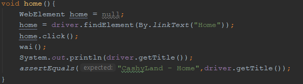

# GESTIONE CASINÒ | Diario di lavoro - 10.04.2019
##### Matan Davidi, Thor Düblin, Matteo Forni, Carlo Pezzotti, Mattia Toscanelli
### Trevano, 10 aprile 2019

## Lavori svolti
Grazie alla dritta data dal cliente, Matan ha potuto modificare il database, aggiungendo la colonna "type" alla tabella "user" che contiene il tipo di utente in modo da potergli mostrare o meno una determinata promozione. Inoltre ha modificato la tabella "media" in modo che non contenga riferimenti ad altre tabelle, e sono state aggiunte tre tabelle ponte al loro posto, una tra "game" e "media", "game_media", una tra "promotion" e "media", "promotion_media", e una tra "room" e "media", "room_media". Infine ha aggiunto una tabella che contiene i valori predefiniti per i tipi di utente chiamata "user_type" e ha rinominato "type" in "media_type".

Adesso lo schema logico del database è il seguente:
- game(room, name, description)
- game_media(game_name, game_room, media_url)
- gender(name)
- media(url, type)
- media_type(name)
- promotion(id, name, description)
- promotion(promotion_id, media_url)
- promotion_user(user_type, promotion_id)
- room(location, description)
- room_media(room_location, media_url)
- user(name, surname, street, house_number, zip_code, city, email, phone_number, gender, password, type, admin)
- user_type(name)

Oggi Thor si è concentrato inizialmente sul risolvere il problema che ha riscontrato l'ultima volta riguardante i test sul server, inizialmente ha lavorato su un server con GUI, per poi passare a installare un server senza GUI cosi da controllare se i test funzionino senza, un'altro problema riscontrato sono le license mancanti siccome su VMWare Workstation sono scadute.

Oggi Carlo si è occupato di continuare con lo sviluppo backend, ovvero ho messo a posto i test su database per via dei cambiamenti visti. Inoltre ho aggiunta la possibilità di eliminare o modificare un utente. Il codice che fa rischieste al database però è ancora stato fatto. Codice di per se nuovo non c'è stato perchè ho solo modificato poche righe di codice nella classe database.

Oggi Matteo ha ripreso il lavoro fatto in passato da Thor. Dopo aver installato Maven, IntellIJ ed aver scaricato il chromedriver ha copiato un vecchio progetto di Matan e vi ha inserito il codice di Thor per verificarne il funzionamento. Dopo aver corretto un paio di percorsi sbagliati i test funzionavano e quindi ha proseguito creando un metodo per ogni pagina così da rendere il codice più pulito.

Questo è stato fatto perchè prima vi erano molte ripetizioni nel codice ed esso diventava inutilmente lungo.
Fatto ciò ha aggiunto i test dei link che mancavano.

##  Problemi riscontrati e soluzioni adottate

Carlo: Non riuscivoa capire perchè i test in locale sul database non andassero, alla fine ho scoperto che il servizio mysql era baggato e con un riavvio ho risolto tutto

##  Punto della situazione rispetto alla pianificazione
Rispetto alla pianificazione siamo in orario.

## Programma di massima per la prossima giornata di lavoro
Matan deve modificare e/o aggiungere le foreign key al database che ha modificato oggi e portarlo sul server di produzione DigitalOcean.

Thor la prossima lezione testera i test di selenium su un server senza interfaccia grafica, e successivamente continuera a programmare il test di Registrazione.

Carlo la prossiamo volta si occuperà di fare le richieste al database per eliminare o modificare gli utenti già esistenti
