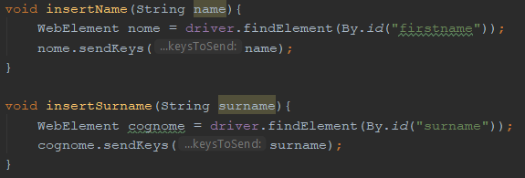

# GESTIONE CASINÒ | Diario di lavoro - 12.04.2019
##### Matan Davidi, Thor Düblin, Matteo Forni, Carlo Pezzotti, Mattia Toscanelli
### Trevano, 12 aprile 2019

## Lavori svolti
Oggi Matan è riuscito ad aggiungere le foreign key al nuovo database, cominciato la lezione precedente, e l'ha esportato in [questo file](../code/sql/DB/cashyland_db_2.sql) con il seguente comando:
```bash
mysqldump --add-drop-table -u user -ppassword cashyland > cashyland_db_2.sql
```
In seguito ha sostituito il database precedente con quello nuovo importandolo con:
```bash
mysql -u user -ppassword cashyland < cashyland_db_2.sql
```

Matteo oggi ha continuato i test su Selenium completando, senza problemi, quello di registrazione e quello di login. Per capire come scrivere negli input ha utilizzato il seguente sito: https://www.guru99.com/accessing-forms-in-webdriver.html.
Per entrambe le due classe di test la struttura utilizzata è stata quella della classe di test dei link quindi con un metodo per ogni pagina da utilizzare ed uno per ogni input in cui scrivere. I metodi degli input sono tutti molto simili.

Per il test di login si utilizza sempre lo stesso utente creato appositamente.

##  Problemi riscontrati e soluzioni adottate


##  Punto della situazione rispetto alla pianificazione
Rispetto alla pianificazione siamo in orario.

## Programma di massima per la prossima giornata di lavoro
