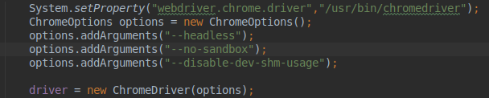

# GESTIONE CASINÒ | Diario di lavoro - 08.05.2019

##### Matan Davidi, Thor Düblin, Matteo Forni, Carlo Pezzotti, Mattia Toscanelli

### Trevano, 8 maggio 2019

## Lavori svolti

Oggi Matan ha proseguito con la documentazione.

Oggi Thor per le prime 2 ore si è soffermato sul problema riguardo ai crash di Chrome quando si avviavano i test di Selenium, provando a aggiungere e modificare ChromeOptions del WebDriver, tuttavia senza trovare ancora soluzione a questo problema, successivamentte si è occupato della documentazione.

Oggi Matteo ha completato tutti i test di Selenium aggiungendo anche le chrome options così da poter eseguire il tutto senza un'interfaccia grafica.

 Negli stessi files ha rimosso tutto il codice inutile ed ha modificato un paio di metodi per ottimizzare il codice. Fatto ciò si è dedicato alla documentazione iniziando a scrivere la parte di implementazione riguardante Jenkins ed i test di Selenium, il testo è momentaneamente in un file in locale in attesa di aggiungere il testo alla documentazione ufficiale. Completata la propria parte di documentazione ha inoltre provato a risolvere il problema riscontrato da Thor senza però riuscire a trovare una soluzione.

 Mattia e Carlo oggi hanno continuato a fare la parte di implementazione della documentazione. Queste parti di documentazioni sono state scritte in locale per non creare conflitti nella file principale.
>>>>>>> 8fb1b5dd66f87ef6bc037da97181e3438508f44f

## Problemi riscontrati e soluzioni adottate

Il bottone "Scopri di più" non porta in basso alla pagina se si sta visitando il sito con Google Chrome.

## Punto della situazione rispetto alla pianificazione

Rispetto alla pianificazione siamo in orario.

## Programma di massima per la prossima giornata di lavoro

Continuare con la documentazione.
