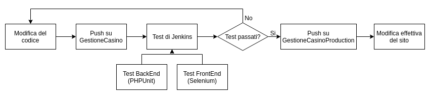

# GESTIONE CASINÒ | Diario di lavoro - 10.05.2019

##### Matan Davidi, Thor Düblin, Matteo Forni, Carlo Pezzotti, Mattia Toscanelli

### Trevano, 10 maggio 2019

## Lavori svolti

Durante la giornata di lavoro di oggi, Matan ha continuato a documentare il progetto, rimuovendo qualche testo segnaposto lasciato dal template, aggiungendo nuovamente il capitolo 2.1, Design dell’architettura del sistema, rimosso l'ultima lezione, contenente il diagramma di flusso dell'applicazione dalla modifica del codice alla messa in produzione, attraverso Jenkins, PHPUnit e Selenium realizzato da Matteo, creando e inserendo i diagrammi UML delle classi Database e MailSender e aggiungendo una descrizione a tutto il sotto-capitolo di PHP all'interno del capitolo 2.3, Design procedurale.

Oggi Matteo ha creato un diagramma di flusso che possa spiegare e rappresentare al meglio
il flusso di lavoro del sito e dei vari software che ci stanno dietro come Jenkins e Selenium.



Dopodiché si è occupato di aiutare Thor nella risoluzione dei problemi di Selenium senza ottenere però grandi risultati.

Oggi Thor si è occupato di risolvere i problemi legati ai test di selenium, risolvendo l'errore riscontrato sui crash di chrome utilizzando firefox e geckodriver, tuttavia si è riscontrato un problema legato alla connessione e all'impossibilità utilizzare porte "DISPLAY".

Carlo oggi ha concluso la parte di gestione delle sale, dei giochi e delle prommozinoni. Per far il tutto ho usato la mia pagina che va ad interpellare il database in modo dinamico, già mostrto e spiegato qualche diario fa. L'aggiunta è stata una parte dinamica che va in base al parametro passato come get, il seguente codice illustra il tutto.

```PHP
if($_GET["type"] == "room"){
    echo'
        <a href="addThings.php?type=room_media"><input type="button" class="form-control" value="Aggiungi un immagine alla sala!"></a>
    ';
}else if($_GET["type"] == "game"){
    echo'
        <a href="addThings.php?type=game_media"><input type="button" class="form-control" value="Aggiungi un immagine al gioco!"></a>
    ';
}else if($_GET["type"] == "promotion"){
    echo'
        <a href="addThings.php?type=promotion_media"><input type="button" class="form-control" value="Aggiungi un immagine alla promozione!"></a>
    ';
}
```

Il seguente codice non fa altro che rimandare l'utente sulla stessa pagina con però un tipo di parametro diverso.
L'ultima cosa che ho fatto è stata la possibilità di aggiungere immagini.
```PHP
require_once "php/loader.php";
    $target_dir = "mediaFiles/";
    $target_file = $target_dir . basename($_FILES["fileToUpload"]["name"]);
    $uploadOk = 1;
    $imageFileType = strtolower(pathinfo($target_file,PATHINFO_EXTENSION));
    $message = "";
    if(isset($_POST["ok"])) {    
        if (file_exists($target_file)) {
            $message .= "Sorry, file already exists. ";
            $uploadOk = 0;
        }
        if ($uploadOk == 0) {
            $message .= "Sorry, your file was not uploaded. ";
        } else {
            if (move_uploaded_file($_FILES["fileToUpload"]["tmp_name"], $target_file)) {
                $db->executeQuery("insert into media values('".$target_file ."','image')");
                $message.= "The file ". basename( $_FILES["fileToUpload"]["name"]). " has been uploaded. ";
            } else {
                $message.="Sorry, there was an error uploading your file. ";
            }
        }
        echo "<script>alert('$message');</script>";
    }
```
Il seguente codice aggiunge un file sul server.

Mattia oggi ha contzinuato a fare la parte di implementazione della documentazione. Piu precisamente le parto grafiche fatte con HTML e css Queste parti di documentazioni sono state scritte in locale per non creare conflitti nella file principale.


## Problemi riscontrati e soluzioni adottate

Thor ha risolto il problema legato ai crash di chrome utilizzando firefox e geckdriver al posto di chrome e rispettivamente chromedriver.
Suvvessivvamente il codice che risolve il problema dei crash di chrome:
```Java
final File firefoxPath = new File(System.getProperty("lmportal.deploy.firefox.path", "/usr/bin/firefox"));

String Xport = System.getProperty("lmportal.xvfb.id", ":1");

driver = new FirefoxDriver( new GeckoDriverService.Builder()
    .usingDriverExecutable(new File("/usr/bin/geckodriver"))
    .usingFirefoxBinary(new FirefoxBinary(firefoxPath))
    .withEnvironment(ImmutableMap.of("DISPLAY", Xport)).build());
```
Tuttavia in questo modo si sono verificati altri problemi legati alla connessione e all'impossibilità di utilizzare i DISPLAY nel server.

## Punto della situazione rispetto alla pianificazione

Rispetto alla pianificazione siamo in orario.

## Programma di massima per la prossima giornata di lavoro

Rinominare le classi e i progetti di Selenium in modo più semantico e farli funzionare.
Continuare con la documentazione.
