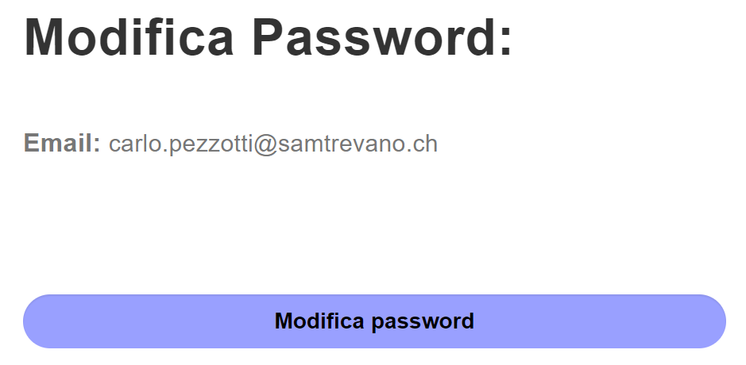

##### Matan Davidi, Thor Düblin, Matteo Forni, Carlo Pezzotti, Mattia Toscanelli

Oggi Mattia ha sistemato il bottone modifica password della pagina di profilo:


Cliccando questo pulsante l'utente verra portato ad una pagina di conferma di modifica password. Questo è stato fatto con il seguente codice:
```html
<form action="modifyPassword.php" method="post">
      <input type="submit" id="modify-password" class="form-control" value="Modifica password">
      <input type="hidden" name="username" value="$_SESSION['username']" ?>
form>
```

La pagina di conferma di modifica password è molto simile a quella di password smarrita, con l'unica differenza che la mail inserita non è modificabile e presa tramite il metodo POST. La pagina di modifica password si presenta così:


Infine ha continuato la parte di implementazione della documentazione, più precisamente la parte della pagina di profilo e di gestione delle pagine.

### Trevano, 15 maggio 2019

## Lavori svolti

## Problemi riscontrati e soluzioni adottate

## Punto della situazione rispetto alla pianificazione

Rispetto alla pianificazione siamo in orario.

## Programma di massima per la prossima giornata di lavoro

Rinominare le classi e i progetti di Selenium in modo più semantico e farli funzionare.

Continuare con la documentazione.
