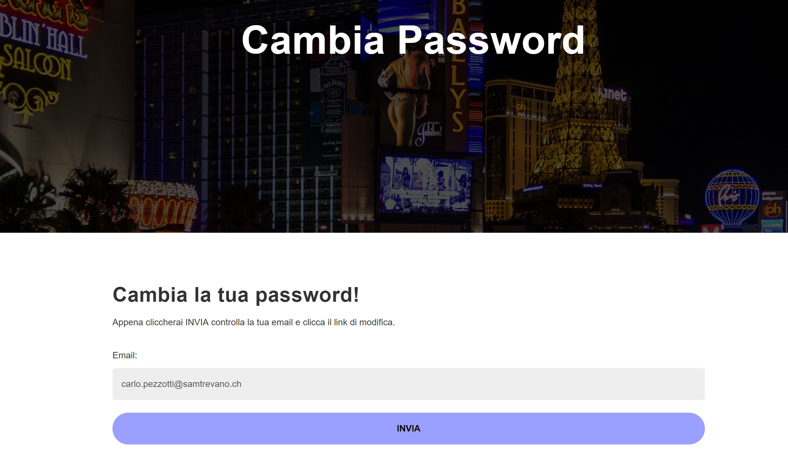
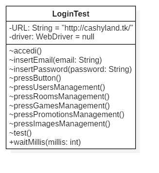
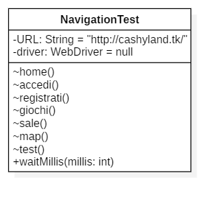
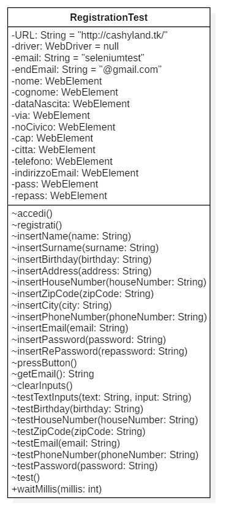
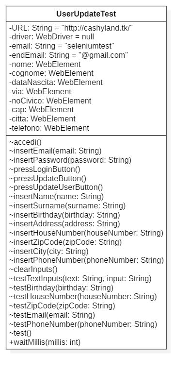
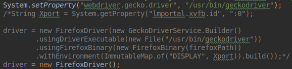
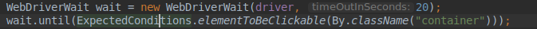

# GESTIONE CASINÒ | Diario di lavoro - 17.05.2019

##### Matan Davidi, Thor Düblin, Matteo Forni, Carlo Pezzotti, Mattia Toscanelli

### Trevano, 17 maggio 2019

## Lavori svolti

Oggi Mattia ha sistemato il bottone modifica password della pagina di profilo:


Cliccando questo pulsante l'utente verrà portato ad una pagina di conferma di modifica password. Questo è stato fatto con il seguente codice:

```html
<form action="modifyPassword.php" method="post">
      <input type="submit" id="modify-password" class="form-control" value="Modifica password">
</form>
```

La pagina di conferma di modifica password è molto simile a quella di password smarrita, con l'unica differenza che la mail inserita non è modificabile e presa tramite il metodo POST. La pagina di modifica password si presenta così:


Infine ha continuato la parte di implementazione della documentazione, più precisamente la parte della pagina di profilo e di gestione delle pagine.

Matan oggi si è occupato di rinominare e in seguito creare i diagrammi UML delle classi, scritte in Java, dei test di Selenium. Queste classi sono state rinominate in:

-   LoginTest
-   NavigationTest
-   RegistrationTest
-   UserUpdateTest






Carlo ha creato la presentazione al cliente del sito web per tutta la durata della giornata di lavoro. Il risultato è visibile seguendo questo [link](../presentation/Gestione Casinò).

Oggi Thor è stato assente le prime 2 ore, le seconde due ore inizialmente si è occupato di dare un’occhiata ai test di Selenium che riscontravano un errore la lezione precedente (riguardante la connessione e il display di xvfb), successivamente si è occupato dei Test Case, capitolo 4.1 della documentazione.

Oggi Matteo ha provato a capire perchè i test di Selenium non funzionano. Data l'assenza di Thor ha provato a seguire da solo una guida trovata su internet al seguente link:
```
https://dzone.com/articles/run-headless-selenium-tests-from-jenkins
```
Prima di fare un test con Jenkins ha però provato ad eseguire a mano lo scipt che il software avrebbe dovuto lanciare
ed esso dava dei problemi ma dopo una brave ricerca ha scoperto che mancava un componente al server e lo ha quindi installato grazie alla seguente pagina con il relativo comando:
```
https://askubuntu.com/questions/1005623/libdbusmenu-glib-warning-unable-to-get-session-bus-failed-to-execute-child

sudo apt-get install dbus-x11
```
Fatto ciò ha dovuto eliminare il lavoro fatto da Thor (per ora solo commentato) nelle ultime lezioni perchè esso causa problemi.



Per lanciare i test ha poi seguito la seguente guida:
```
http://elementalselenium.com/tips/38-headless
```

Dopo questi passaggi i test hanno iniziato, in parte, a funzionare. Essi infatti riescono a caricare la pagina iniziale ma non riescono a trovare gli elementi di essa.
Per cercare di risolvere il problema Matteo ha provato ad aggiungere il seguente codice che dovrebbe bloccare il test fino a che la pagina non sia completamente caricata.



Questo non ha comunque risolto i problemi.

## Problemi riscontrati e soluzioni adottate

## Punto della situazione rispetto alla pianificazione

Rispetto alla pianificazione siamo in orario.

## Programma di massima per la prossima giornata di lavoro

Continuare con la documentazione.
